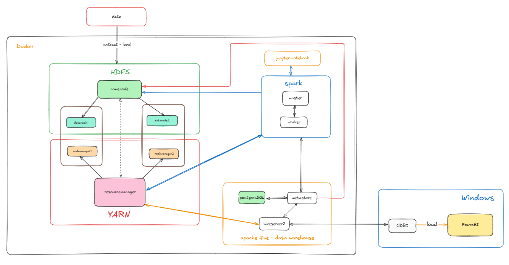

# README for Docker-based Big Data Project

This project is designed to manage a big data environment using Docker, Hadoop, Apache Spark, and Jupyter Notebook. The Makefile provided automates several tasks such as starting and stopping Docker containers, updating environment variables, and interacting with HDFS.

## Table of Contents

1. [Requirements](#requirements)
2. [Makefile Targets](#makefile-targets)
3. [Architecture](#architecture)
4. [How to Setup](#how-to-setup)
5. [Connect Apache Hive to PowerBI in Windows](#connect-apache-hive-to-powerbi-in-windows)

## Requirements

- Docker and Docker Compose installed
- Apache Spark, Jupyter Notebook, and Hadoop containers setup
- Docker-based environment for running Spark jobs and Jupyter Notebooks
- A directory containing data to be processed (`./data_crawl`)
- Power BI on Windows for visualization

## Makefile Targets

### 1. `all`
Runs the `up` target and sets up Jupyter permissions. This is the default target when running `make`.

### 2. `push2hdfs`
Uploads the `data_crawl` directory to HDFS. It performs the following tasks:
- Copies `data_crawl` to the `namenode` container.
- Creates a `/user/root` directory in HDFS if it does not exist.
- Uploads `data_crawl` to `/user/root/` in HDFS.

### 3. `.update-env`
Updates the `.env` file with the current notebook directory path. The path to the Jupyter notebook directory (`NOTEBOOK_DIR`) is stored in the `.env` file.

### 4. `.jupyter-permission`
Sets the correct file permissions for the Jupyter Notebook workspace in the `pyspark-notebook` container. It ensures that the `jovyan` user has ownership of the `work` directory, allowing proper file access and modification.

### 5. `jupyter-token`
Retrieves the Jupyter Notebook server token. This is useful for accessing the Jupyter Notebook interface running inside the container.

### 6. `up`
- Updates the `.env` file using the `.update-env` target.
- Starts Docker Compose, which brings up the required containers (such as Spark and Jupyter Notebook).

### 7. `down`
Stops and removes the running Docker containers associated with the project.

## Architecture

    

## How to Setup

1. **Start the environment:**
   To start the Docker containers, use the following command:
   ```bash
   make 
2. **Crawl data and Push data to HDFS:** 
   After the environment is up, upload the data_crawl directory to HDFS by running:
   ```bash
   python ./crawl-code/crawl-crypto.py
   make push2hdfs
3. **Access Jupyter Notebook:**
   To retrieve the Jupyter Notebook server token and access the interface, run:
   ```bash 
   make jupyter-token
4. **Stop the environment:**
   To stop all running Docker containers and services, use the following command:
   ```bash
   make down

## Connect Apache Hive to PowerBI in Windows

Source: https://medium.com/emorphis-technologies/how-to-connect-microsoft-power-bi-with-hive-a778a1fdd234

1. **Download Hive OBDC Driver:**
   From this link: https://www.microsoft.com/en-us/download/details.aspx?id=40886
2. **Config ODBSC:**
   
   Go to the Configure: 

    

   Setup config:

    

   Test:

    

   Then Click to OK -> OK
3. **Connect to PowerBI:**
   
   PowerBI Home -> Get Data -> More -> Other -> ODBC -> Sample Microsoft Hive DSN -> OK

    